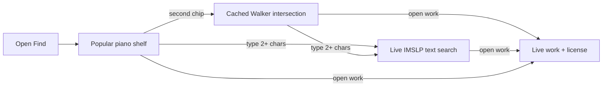
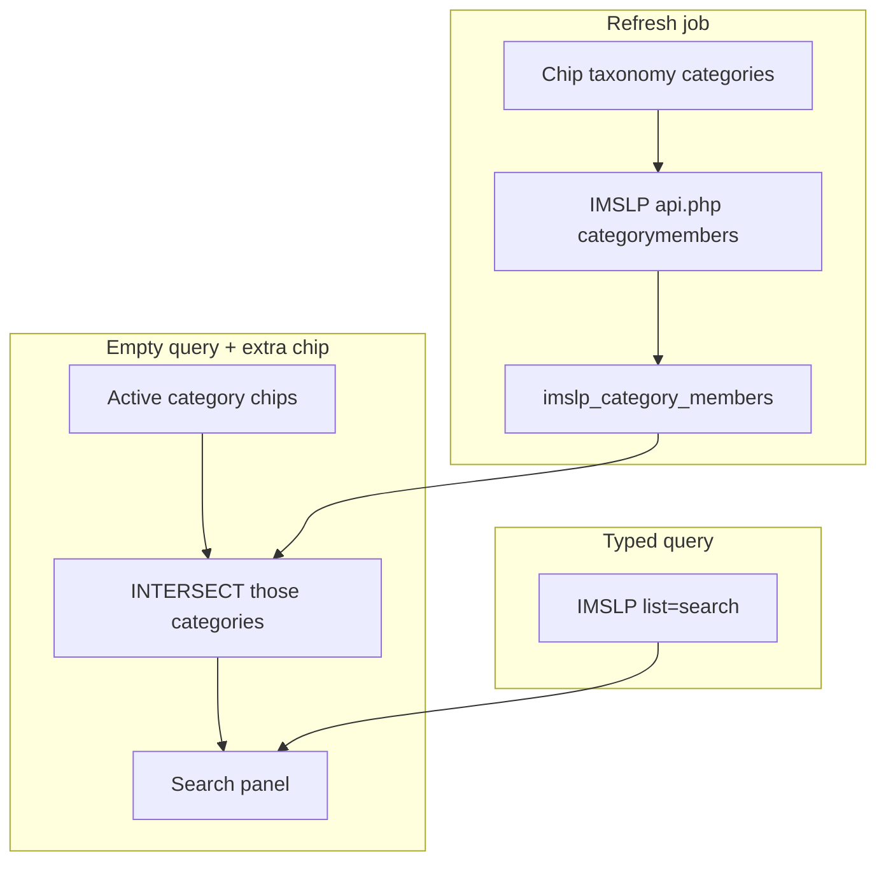

# IMSLP Walker Search - Plan

> **Status (2026-09-02):** A first Walker cut landed on this branch (`imslp-category-sync`, `imslp_intersect_categories`). The IMSLP Search Gap Closure plan (`imslp_search_gap_closure_b7979f1c`) supersedes it: generation-based cache, `imslp-sync` cron, date/period axis, multi-select, paging. Canvases kept as-is.

## Goal Capsule

**Objective.** A teacher can get any IMSLP work into the studio with less friction: chips show the same set IMSLP’s Category Walker would, instantly; typing still reaches the rest of the archive; opening a work still fetches a live file and license.

**Product authority.** This plan owns chip meaning, default vs intersection browse, and the membership cache that makes intersections fast. Typed-search ranking, work-page fetch, license gates, and download stay as they are except where browse hands them a title.

**Stop conditions.** Stop if IMSLP blocks categorymembers pagination for the chip set, or if a period category we map a chip to is not a work category. Do not fall back to surname seeds.

**Execution profile.** Test-first on taxonomy and browse. Prove Piano · Baroque is a real intersection before rewriting the UI copy.

**Tail ownership.** One PR on `imslp/search-overhaul`. No extra cleanup beyond this browse path.

**Open blockers.** None.

## Product Contract

### Summary

Treat every search chip as one IMSLP category. When two or more chips are on, show the Category Walker intersection of those categories. Piano-only (the default) stays the Popular shelf. Typed queries reach any other work. File and license fetches stay live on IMSLP.

### Problem Frame

Teachers tap common chips (Piano · Baroque) and get zero. Cleffy does not query IMSLP’s period categories. It walks the first ~160 A–Z pages of For piano and keeps titles that contain a handful of surnames. IMSLP already has Category:Baroque and a Walker intersection For piano ∩ Baroque of about 61 works. The empty state is a false zero. That blocks import: people stop using chips, or believe the piece is not on IMSLP.

### Key Decisions

- Archive truth. Results must match what a Category Walker intersection of the named categories would list, not a Cleffy surname seed. (session-settled: user-directed — chosen over catalog-only or “honest empty”: they want what they would see if they searched IMSLP.) Governs R1, R2, R6.
- Split Modern. Two era chips: Early 20th century and Modern, each bound to that IMSLP category. (session-settled: user-directed — chosen over one Modern chip pointed at either category.) Governs R3.
- Popular then Walker. Default Piano-only stays the curated Popular shelf. A second chip switches to the intersection. (session-settled: user-directed — chosen over paging all of For piano on first paint, and over dropping the Piano default.) Governs R4, R5.
- Cache the intersections. Live categorymembers cannot AND 50k-page categories at request time. Speed comes from serving a maintained intersection, not from paging the wiki on each tap. Governs R7.
- Any piece via type. Chips are a fast on-ramp, not the catalog. A typed query must still find works outside Popular and outside the active intersection. Governs R8, R11.

### Actors

- A1. Teacher (or student) on Find on IMSLP.
- A2. IMSLP category graph (For piano, Nocturnes, Baroque, Early 20th century, Modern, composer categories, and the rest of the chip set).
- A3. Cleffy Popular shelf (curated, tagged works). Used only for the default / empty-chip-beyond-Piano state.

### Requirements

**Chips as IMSLP categories**

- R1. Every instrument, form, era, and composer chip maps to exactly one IMSLP category title. No chip is implemented as a title-substring or surname list.
- R2. Era chips are Baroque, Classical, Romantic, Early 20th century, and Modern, mapped to those IMSLP category names.
- R3. The former single Modern chip is replaced by Early 20th century and Modern. Debussy / Ravel / Rachmaninoff belong to Early 20th century on IMSLP, not Modern.

**When each source answers**

- R4. With only the default Piano instrument chip and no query, show the Popular shelf filtered to piano. Do not fetch or claim an IMSLP listing for that state.
- R5. When any additional chip is on (era, form, composer, or a non-default instrument) and the query is empty, show the Walker intersection of the active category chips, not Popular. Key is not a category chip.
- R6. Triple and higher intersections (Piano · Fugue · Modern) use the same Walker rule as pairs. An empty intersection may say nothing matches those IMSLP categories. It must not say that after a partial scan.
- R7. Intersection results for chip browse paint from a maintained cache, not from a live walk of Category:For piano (or any other large category) capped at a few pages.
- R8. A typed query (two or more characters) uses live IMSLP text search, as today. Chips may still constrain that search, but they do not replace it with Popular.
- R11. A work that is on IMSLP and not in Popular must still be reachable by typing its title or composer, including when no era chip is on.

**Honesty**

- R9. Status copy names the IMSLP categories in force (for example Piano · Baroque), not “Popular”, when R5 is answering.
- R10. Do not show “Nothing on IMSLP matches these filters” unless the full intersection for those categories is known to be empty.

### Key Flows

- F1. Default open
  - **Trigger:** A1 opens Find on IMSLP with no typed query.
  - **Actors:** A1, A3
  - **Steps:** Piano is pre-selected. Popular piano works render with no IMSLP round trip.
  - **Covered by:** R4
- F2. Second chip
  - **Trigger:** A1 adds Baroque (or any other non-default chip) with the query still empty.
  - **Actors:** A1, A2
  - **Steps:** Popular is replaced by the cached For piano ∩ Baroque set. First rows appear without waiting on a live wiki walk.
  - **Covered by:** R5, R7, R9
- F3. Triple chips
  - **Trigger:** A1 has Piano + Fugue + Modern, empty query.
  - **Actors:** A1, A2
  - **Steps:** Show the three-category Walker intersection. If that set is empty, say so as a complete intersection, not as a failed scan.
  - **Covered by:** R6, R10
- F4. Type a title
  - **Trigger:** A1 types two or more characters.
  - **Actors:** A1, A2
  - **Steps:** Live IMSLP text search runs. Chip constraints may apply. Popular is not the answer set. Works outside the cache remain reachable.
  - **Covered by:** R8, R11
- F5. Open and add
  - **Trigger:** A1 opens a work from any of the above.
  - **Actors:** A1, A2
  - **Steps:** Work page, editions, and license/download stay on the existing live IMSLP path.

### Acceptance Examples

- AE1. Piano · Baroque, empty query
  - **Covers R5, R7, R10.**
  - **Given:** A1 has Piano and Baroque on, query empty.
  - **When:** Results render.
  - **Then:** The set is the IMSLP For piano ∩ Baroque intersection (on the order of tens of works, including composers outside Bach / Vivaldi / Handel / Pachelbel). It is not zero because the first 160 For piano pages lacked those surnames.

- AE2. Piano · Early 20th century vs Piano · Modern
  - **Covers R2, R3.**
  - **Given:** Empty query.
  - **When:** A1 selects Early 20th century, then switches to Modern.
  - **Then:** Early 20th century includes Debussy / Ravel / Rachmaninoff works that IMSLP files there. Modern does not use that surname list and follows Category:Modern.

- AE3. Default vs second chip
  - **Covers R4, R5, R9.**
  - **Given:** Fresh Find on IMSLP.
  - **When:** Only default Piano is on, then A1 adds Nocturne.
  - **Then:** First paint is Popular piano. After Nocturne, status is the intersection (Piano · Nocturne) and the rows are Category:Nocturnes ∩ For piano, not the two curated nocturnes alone.

- AE4. Piano · Fugue · Modern empty
  - **Covers R6, R10.**
  - **Given:** Those three chips, empty query, and the Walker intersection is empty.
  - **When:** Results render.
  - **Then:** Empty is allowed. Copy does not claim a partial IMSLP scan failed.

- AE5. Type a work outside Popular
  - **Covers R8, R11.**
  - **Given:** Default Piano-only, query `gershwin rhapsody` or another title not on the Popular shelf.
  - **When:** Search returns.
  - **Then:** Live IMSLP hits include that work. The panel does not substitute Popular or say the archive has nothing.

### Success Criteria

- Chip-only browse that R5 answers does not block first paint on a live IMSLP category walk.
- Piano · Baroque is non-empty and is not limited to the four Popular Baroque piano works.
- The words “Nothing on IMSLP matches these filters” do not appear for Piano · Baroque or Piano · Early 20th century.
- A teacher can still import a work that is on IMSLP and not in Popular by typing it.

### Scope Boundaries

- In: chip meaning, default vs intersection, honesty of empty states, triples, membership cache, keeping typed search as the path to the rest of the archive.
- Deferred for later: typed-search ranking changes, Popular list growth, work-page and license behavior, building a full IMSLP work mirror.
- Deferred to Follow-Up Work: a hosted weekly cron for membership refresh if local/CLI sync is enough for first ship; Key as a Walker category if IMSLP later exposes one.
- Out: surname-seed era; treating Popular as the answer to multi-chip browse; scraping Special:CategoryWalker; claiming live MediaWiki `categorymembers` (50 per page) can AND large categories at request time.

### Dependencies / Assumptions

- IMSLP period categories Baroque, Classical, Romantic, Early 20th century, and Modern exist as work categories and are what Category Walker intersects with For piano.
- Category Walker counts (For piano ∩ Baroque ~61, Classical ~788, Romantic ~6439, Early 20th century ~1361, Modern ~737) are order-of-magnitude guides from IMSLP forum documentation, not a SLA.
- Key chips have no IMSLP category. Key stays a typed-search title constraint only.

### Outstanding Questions

- Deferred to Planning: none remaining that block this plan. Pagination and sort for large intersections (Romantic piano) are KTD6.

### Sources / Research

- IMSLP `Category:Baroque`, `Category:Modern`, `Category:Early 20th century`, `Category:For piano` (live page sizes).
- IMSLP forums: Category Walker For piano period counts (Philip).
- Special:CategoryWalker is bot-checked from this environment; do not use it as the fetch path.
- Repo: `supabase/functions/_shared/searchFacetData.ts`; `supabase/functions/imslp-search/index.ts` (`browseByFilters`); `src/features/imslp/ImslpSearchPanel.tsx` (`isLiveQuery`); `supabase/functions/_shared/popularWorks.ts`; `supabase/migrations/20260830101624_imslp_file_licenses.sql` (service_role cache table pattern).

---

## Planning Contract

### Key Technical Decisions

- KTD1. Store full membership of each chip category and INTERSECT in Postgres. Do not scrape Category Walker. (session-settled: user-approved — chosen over Walker HTML: IMSLP bot-checks Special:CategoryWalker; MediaWiki `list=categorymembers` is the documented list API.) Instantiates R1, R5, R7.
- KTD2. Sync is a service_role job that pages `categorymembers` for every category named by the taxonomy. Browse never pages IMSLP. Cold cache returns a distinct “index not ready” state, not a false empty. Instantiates R7, R10.
- KTD3. Instrument membership is the named category union its `(arr)` variant, matching today’s hard-filter pair (`For piano` ∪ `For piano (arr)`). Instantiates R5.
- KTD4. Remove `ERA_COMPOSER_SEEDS` from browse and from `titleMatchesFilters` era checks. Era is category membership only. Instantiates R1, R2.
- KTD5. Typed search stays on MediaWiki `list=search`. Do not require a work to be in the membership table to appear. Instantiates R8, R11.
- KTD6. Cached browse honors existing sort: `title` and `recent` if `timestamp` was stored at sync; `relevance` / Best is shorter-title order as today, then title. Page the intersection to the current search limit. Instantiates R5.

### High-Level Technical Design

Directional only.

Membership rows are `(category_title, page_title, page_id, last_seen_at)`. Intersection is titles present in every selected category (instrument uses KTD3’s union as one side).

### Assumptions

- IMSLP allows periodic categorymembers pagination from the edge/sync job at a polite rate. If a category fails mid-sync, keep the previous complete snapshot for that category.
- Local `functions:serve` plus a one-shot sync (or fixture rows in tests) is enough to verify browse. Hosted cron can follow.

### Sequencing

U1 taxonomy → U2 table and sync → U3 browse rewrite → U4 UI chips and copy → U5 tests can overlap U1/U3 as they land.

---

## Implementation Units

### U1. Bind chips to IMSLP categories

**Goal:** The shared taxonomy names a real IMSLP category for every instrument, form, era, and composer chip, including the split era set.

**Requirements:** R1, R2, R3. KTD4.

**Dependencies:** None.

**Files:** `supabase/functions/_shared/searchFacetData.ts`; `src/features/imslp/searchFacets.ts`; `supabase/functions/_shared/popularWorks.ts` (era id on curated rows that said `modern` but are Early 20th century); `tests/imslp/filters.test.ts`.

**Approach:**

1. Add `category` on each era facet: `Baroque`, `Classical`, `Romantic`, `Early 20th century`, `Modern`.
2. Add era id `early-20th` (label Early 20th century). Keep `modern` as Category:Modern only.
3. Stop using `ERA_COMPOSER_SEEDS` in `titleMatchesFilters` and `facetTokens` for browse. Delete the seed table if nothing else needs it, or keep it unused only if a test still documents the old lie — prefer delete.
4. Re-tag Popular works: Debussy / Ravel / Satie / Rachmaninoff / Joplin → `early-20th`, not `modern`, when that matches IMSLP.

**Test scenarios:**

- parseFilters accepts `early-20th` and `modern` and drops unknown era ids.
- Era facets expose the five IMSLP category titles.
- titleMatchesFilters with only `era: 'baroque'` does not require “Bach” in the title.
- Covers AE2. Popular Debussy-era rows use `early-20th`.

**Verification:** `tests/imslp/filters.test.ts` green. No remaining browse path reads `ERA_COMPOSER_SEEDS`.

### U2. Category membership table and sync

**Goal:** Persist IMSLP category membership for every chip category so browse can INTERSECT without walking the wiki.

**Requirements:** R7, R10. KTD1, KTD2, KTD3.

**Dependencies:** U1.

**Files:** new migration under `supabase/migrations/`; sync helper used by a small edge function or `scripts/` job; `supabase/functions/_shared/imslp.ts` (existing `IMSLP_API`); grant pattern from `supabase/migrations/20260830101624_imslp_file_licenses.sql`.

**Approach:**

1. Table `imslp_category_members`: category text, page title, page id, last_seen_at. Primary key `(category, page_title)`. RLS on, service_role only, same as `imslp_file_licenses`.
2. Sync pages `list=categorymembers` (`cmnamespace=0`, `cmtype=page`) until `cmcontinue` ends, per category in the taxonomy plus each instrument `(arr)` variant.
3. Replace one category’s rows in a transaction after a complete fetch. Partial failure leaves the previous snapshot.
4. Record sync status per category (ok / failed / never) so browse can distinguish empty intersection from missing index.
5. First ship: invocable sync (CLI or admin/service call). Hosted weekly cron is follow-up.

**Test scenarios:**

- Sync of a fixture category writes all members and replaces the previous snapshot.
- Failed page mid-category leaves the old snapshot and marks that category failed.
- Instrument sync includes `For piano (arr)` as its own category rows (KTD3).

**Verification:** Migration applies locally. Tests cover replace-vs-keep on failure. No Special:CategoryWalker URL in the job.

**Execution note:** Implement sync replace/failure tests before the live pager.

### U3. Browse from intersection, not live walks

**Goal:** Empty-query multi-chip search returns the cached INTERSECT set.

**Requirements:** R5, R6, R7, R10. KTD1, KTD3, KTD5, KTD6.

**Dependencies:** U1, U2.

**Files:** `supabase/functions/imslp-search/index.ts`; `tests/imslp/search.test.ts`.

**Approach:**

1. When the query is shorter than 2 characters and category chips beyond default-piano-alone are active, resolve category titles from the taxonomy (KTD3 for instrument), INTERSECT membership, apply sort and limit.
2. If any required category has no successful snapshot, return an index-not-ready error or empty-with-flag. Do not return “no matches” (R10).
3. If all snapshots exist and the intersection is empty, return zero results (honest empty).
4. Remove the 100–160 `mwCategoryMembers` browse cap from this path. Keep `mwCategoryMembers` only if typed-search or another path still needs it; otherwise delete.
5. Typed search (`q.length >= 2`) stays `mwSearch`. Do not require membership rows.

**Test scenarios:**

- Covers AE1. Fixture For piano ∩ Baroque returns titles that are in both sets, including a non-seed surname, and is non-empty.
- Covers AE4. Three-way intersection empty when fixtures have no common title; response is honest empty, not index-not-ready.
- Missing snapshot for Baroque → not “no matches”.
- Typed `moonlight` still hits the search path with no membership table rows.

**Verification:** `tests/imslp/search.test.ts` covers browse vs search modes without calling IMSLP.

### U4. Search panel chips and copy

**Goal:** The UI exposes the split era chips, keeps Popular on default Piano-only, and tells the truth when the cache answers.

**Requirements:** R3, R4, R5, R8, R9, R10, R11. F1–F5.

**Dependencies:** U1, U3.

**Files:** `src/features/imslp/ImslpSearchPanel.tsx`; `src/features/imslp/searchFacets.ts`; `src/features/imslp/ImslpBrowser.test.tsx`; empty-state copy in the panel.

**Approach:**

1. Era dimension renders five chips. Selecting Early 20th century or Modern sends the new ids through `buildSearchFilters`.
2. Keep `isLiveQuery` for typed queries and for non-default chips so the panel asks `imslp-search`. Default Piano-only still uses Popular with no network (R4).
3. Replace “Nothing on IMSLP matches these filters” with copy that is only used when the API says the intersection is complete and empty. Index-not-ready gets a different line.
4. Do not change work-open or download.

**Test scenarios:**

- Covers AE3. Default state: Popular piano, no `imslp-search` call. Adding Nocturne calls search and does not keep Popular as the result list.
- Covers AE5. Typed query still calls search.
- Empty complete intersection does not use the partial-scan sentence.
- Era row shows Early 20th century and Modern.

**Verification:** `ImslpBrowser.test.tsx` (or the panel’s existing test file) covers default vs second chip vs type.

### U5. Characterization of era-seed removal

**Goal:** Existing rank/search tests that assumed era surname tokens keep passing or are updated to the new contract.

**Requirements:** R1, R8.

**Dependencies:** U1, U3.

**Files:** `tests/imslp/search.test.ts`; `tests/imslp/rank.test.ts`; `tests/imslp/filters.test.ts`.

**Approach:** Grep for `ERA_COMPOSER_SEEDS`, `baroque`, and era token expectations. Update tests that encoded the old seed browse. Do not change ranker behavior except where it injected era surnames into `srsearch`.

**Test scenarios:**

- Rank tests that do not involve era seeds stay unchanged.
- Any test that expected browse to filter to Bach/Vivaldi is rewritten to membership intersection.

**Verification:** `npm test -- tests/imslp` green.

---

## Verification Contract

- `npm test -- tests/imslp` must pass.
- `npm run typecheck` must pass.
- Local: apply the new migration, run sync for at least `For piano` and `Baroque` (or load fixtures), then Piano · Baroque on `/search` is non-empty and includes a work whose title does not contain Bach, Vivaldi, Handel, or Pachelbel.
- Typed search for a non-Popular title still returns IMSLP hits.

## Definition of Done

- All units U1–U5 meet their verification.
- AE1–AE5 are covered by automated tests or the local browse check above.
- No browse path uses surname seeds.
- No Category Walker scrape.
- Abandoned sync experiments are not left in the tree.
- A teacher can import from Popular, from a Walker intersection, or by typing a title not in either list.

---

## Risks and dependencies

- IMSLP may rate-limit a full For piano sync (~54k / 50 per page). Mitigate with backoff, resume tokens, and snapshot replace only on completion.
- Stale membership: a new work will not appear in chip browse until the next successful sync. Typed search still finds it (R11).
- Category:Modern on IMSLP is living/recent music. The chip will look unlike Debussy. That is intended (R3).
