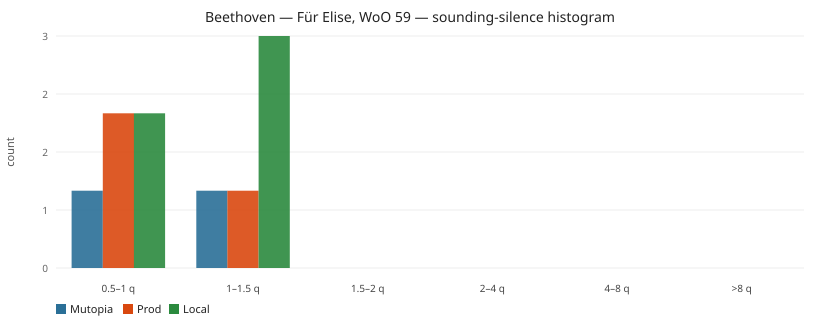
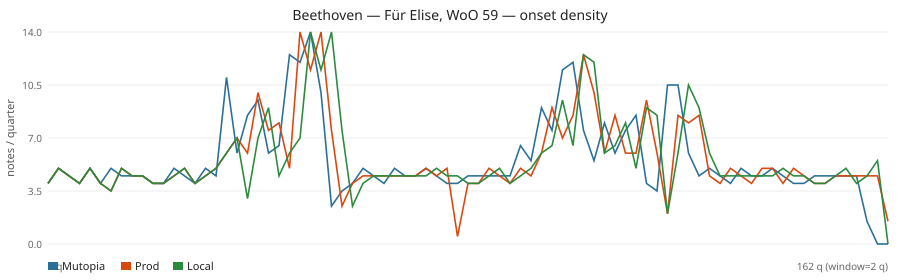

# Listen proxy: Beethoven — Für Elise, WoO 59

**We cannot audition.** No speaker path, and this machine has `afplay` but no FluidSynth/TiMidity/soundfont, so WAV render was skipped. Below is the closest objective evidence: MIDI onset/silence timelines (sounding-envelope = RMS-energy proxy).

## Verdict

Für Elise does **not** drop out in long pauses. Mutopia / prod / local note counts are 905 / 901 / 904. Sounding coverage is 99% / 98% / 91%. There are **zero** empty 2-quarter windows vs Mutopia. The “missed notes” a listener would hear are **wrong pitches**, not holes: eval missing 198 prod / 179 local, pitch 71.3% / 73.6%, melody survival 25.9% on both. Local adds two extra 1-quarter holes inside **overfull** mm. 25 and 28 (page 1) plus shorter note durations (mean 0.29q vs Mutopia 0.32q), which is a bit more dead air, not a fermata.

Wall-clock notes/sec looks “busier” (9.0 vs Mutopia 6.9) only because both OMR MIDIs play at **96 bpm** vs Mutopia **72**. That is a tempo error, not extra notes.

## Inputs

- Mutopia: `eval/cache/downloads/fur-elise-midi/fur-elise.mid` (tpq 384, tempos [{'tick': 0, 'bpm': 72.0}])
- Prod OMR: `eval/results/fur-elise-shootout/prod-from-scoredata.mid` (901 notes in score.json)
- Local OMR: `eval/results/fur-elise-shootout/local-from-scoredata.mid` (904 notes in score.json)
- Eval already: pitch 71.3% prod / 73.6% local; missing 198 / 179; extra 194 / 178.

## Headline

|  | notes | dur (q) | dur (s, file tempo) | tempo0 | notes/q | notes/s | sounding | gaps ≥0.5q | gaps ≥1q | gaps ≥1.5q | gaps ≥4q | median IOI q | p95 IOI q | max IOI q |
| --- | ---: | ---: | ---: | ---: | ---: | ---: | ---: | ---: | ---: | ---: | ---: | ---: | ---: | ---: |
| Mutopia | 905 | 156.5 | 130.42 | 72.0 | 5.783 | 6.939 | 0.99 | 2 | 1 | 0 | 0 | 0.25 | 0.25 | 1.5 |
| Prod | 901 | 160.5 | 100.31 | 96.0 | 5.614 | 8.982 | 0.984 | 3 | 1 | 0 | 0 | 0.25 | 0.25 | 2.0 |
| Local | 904 | 160.2 | 100.12 | 96.0 | 5.643 | 9.029 | 0.907 | 5 | 3 | 0 | 0 | 0.25 | 0.25 | 1.5 |

## Gap histogram (sounding silences)

| bin | Mutopia | Prod | Local |
| --- | ---: | ---: | ---: |
| 0.5–1 q | 1 | 2 | 2 |
| 1–1.5 q | 1 | 1 | 3 |
| 1.5–2 q | 0 | 0 | 0 |
| 2–4 q | 0 | 0 | 0 |
| 4–8 q | 0 | 0 | 0 |
| >8 q | 0 | 0 | 0 |

## Onset density over the piece

Windows of 2 quarter-notes. Empty-while-Mutopia (Mutopia has ≥1 onset, OMR has 0):

| | empty windows | empty duration (q) | sparse (<40% of Mutopia, Mutopia≥2) | first empty starts (q) |
| --- | ---: | ---: | ---: | --- |
| Prod vs Mutopia | 0 | 0.0 | 2 | — |
| Local vs Mutopia | 0 | 0.0 | 2 | — |

## Longest silences (sounding holes)

### Mutopia
| dur (q) | start (q) | end (q) |
| ---: | ---: | ---: |
| 1.0 | 116.0 | 117.0 |
| 0.5 | 115.0 | 115.5 |

### Prod
| dur (q) | start (q) | end (q) |
| ---: | ---: | ---: |
| 1.0 | 119.25 | 120.25 |
| 0.5 | 12.0 | 12.5 |
| 0.5 | 118.25 | 118.75 |

### Local
| dur (q) | start (q) | end (q) |
| ---: | ---: | ---: |
| 1.05 | 119.7 | 120.75 |
| 1.0 | 39.0 | 40.0 |
| 1.0 | 44.5 | 45.5 |
| 0.78 | 11.72 | 12.5 |
| 0.6 | 118.65 | 119.25 |

## How to read this vs “pauses” / “missed notes”

- **Pauses:** count of gaps ≥1q and ≥1.5q (a full 3/8 bar) / ≥4q (a 4/4 bar). Mutopia should be near-continuous in these pieces; extra long holes in prod/local are dropped measures, underfull bars, or movement-seam junk.
- **Missed notes:** Mutopia note count minus OMR, plus empty-while-Mutopia windows. Pitch-eval missing counts (Für Elise prod 198 / local 179; Pathétique prod 1554 / local 1316) are the paired-pitch version of the same story.
- Tempo is **not** a listen: both OMR Für Elise MIDIs are 96 vs Mutopia 72. Trust notes/quarter and silence-in-quarters.

WAV/RMS: skipped (no synth). The sounding-coverage column is the MIDI equivalent of “how much of the timeline has energy.”
