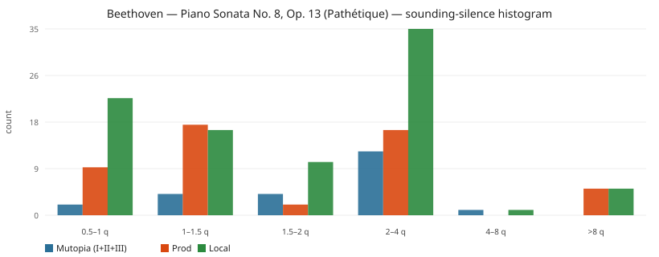
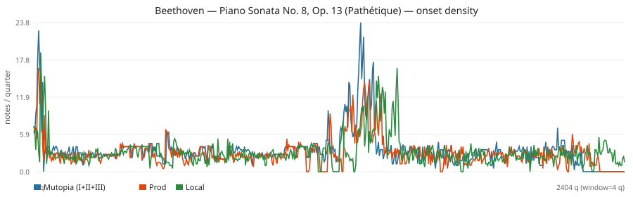

# Listen proxy: Beethoven — Piano Sonata No. 8, Op. 13 (Pathétique)

**We cannot audition.** No speaker path, and this machine has `afplay` but no FluidSynth/TiMidity/soundfont, so WAV render was skipped. Below is the closest objective evidence: MIDI onset/silence timelines (sounding-envelope = RMS-energy proxy).

## Verdict

Pathétique **does** pause, and it **does** miss notes. Same holes in prod and local (this is not a local-only regression):

| What you’d hear | Mutopia | Prod | Local |
| --- | ---: | ---: | ---: |
| Notes | 8299 | 7219 (−13%) | 7631 (−8%) |
| Gaps ≥1 quarter | 21 | 40 | 67 |
| Gaps >8 quarters | 0 | **5** | **5** |
| Longest hole | 4.0 q (~1 bar) | **33.3 q (~8 empty bars)** | **33.4 q (~8 empty bars)** |
| Sounding coverage | 97.8% | 93.3% | 88.2% |
| Eval missing pitches | — | 1554 | 1316 |

The 33-quarter hole is **eight consecutive empty printed bars** near the end of movement I (prod mm. 287–294, page 8; local mm. 285–292, page 8). Same pattern: 4 empty bars around I mm. 273–276 (page 7), 2 empty bars at the I→II seam, then 3 empty bars in III (page 13 mm. 54–56 and page 17 mm. 177–179). Local recovers ~400 more notes than prod but **creates more small holes** (overfull ticks 89k vs 39k) and still has the same multi-bar dropouts.

Empty-while-Mutopia windows: 72q prod / 68q local of timeline where Mutopia has onsets and OMR has none.

## Inputs

- Mutopia: `pathetique-1/2/3.mid` concatenated in musical time with **no extra seam gap**.
- Prod/local MIDIs exported this run from `pathetique-prod/score.json` and `pathetique-local/score.json` → `pathetique-shootout/{prod,local}-from-scoredata.mid`.
- Eval already: pitch 78.0% prod / 80.7% local; missing **1554 / 1316**; extra 474 / 648; overfull ticks 39080 / 89360.
- PDF sha identical (`8d1f6b5f…`).

### Per movement (Mutopia files vs OMR slices at 2/4 then 2/2)

| mv | notes Mutopia | notes Prod | notes Local | Mutopia notes/q | Prod notes/q | Local notes/q | Mutopia gaps≥1q | Prod ≥1q | Local ≥1q | Mutopia longest q | Prod longest | Local longest |
| --- | ---: | ---: | ---: | ---: | ---: | ---: | ---: | ---: | ---: | ---: | ---: | ---: |
| I | 4285 | 3651 | 3856 | 3.442 | 2.922 | 2.965 | 9 | 16 | 29 | 4.0 | 33.25 | 33.38 |
| II | 1629 | 1373 | 1508 | 11.158 | 8.328 | 8.397 | 0 | 0 | 5 | 0 | 0.5 | 2.0 |
| III | 2385 | 2195 | 2267 | 2.844 | 2.515 | 2.49 | 12 | 23 | 32 | 3.0 | 15.0 | 15.0 |

OMR slice bounds (quarters): prod [('I', 0.0, 1260.2916666666667), ('II', 1260.2916666666667, 1425.1666666666667), ('III', 1425.1666666666667, 2300.9166666666665)]; local [('I', 0.0, 1311.6666666666667), ('II', 1311.6666666666667, 1491.25), ('III', 1491.25, 2404.6666666666665)].
Mutopia movement tempos: I [{'tick': 0, 'bpm': 33.0}, {'tick': 15360, 'bpm': 288.0}, {'tick': 207360, 'bpm': 33.0}, {'tick': 213504, 'bpm': 288.0}]; II [{'tick': 0, 'bpm': 36.0}]; III [{'tick': 0, 'bpm': 216.0}].

## Headline

|  | notes | dur (q) | dur (s, file tempo) | tempo0 | notes/q | notes/s | sounding | gaps ≥0.5q | gaps ≥1q | gaps ≥1.5q | gaps ≥4q | median IOI q | p95 IOI q | max IOI q |
| --- | ---: | ---: | ---: | ---: | ---: | ---: | ---: | ---: | ---: | ---: | ---: | ---: | ---: | ---: |
| Mutopia (I+II+III) | 8299 | 2229.5 | 851.53 | 33.0 | 3.722 | 9.746 | 0.978 | 23 | 21 | 17 | 1 | 0.5 | 1.0 | 7.0 |
| Prod | 7219 | 2297.92 | 1148.96 | 120.0 | 3.142 | 6.283 | 0.933 | 49 | 40 | 23 | 5 | 0.5 | 1.0 | 34.25 |
| Local | 7631 | 2401.67 | 1193.74 | 145.0 | 3.177 | 6.393 | 0.882 | 89 | 67 | 51 | 6 | 0.5 | 1.0 | 34.375 |

## Gap histogram (sounding silences)

| bin | Mutopia | Prod | Local |
| --- | ---: | ---: | ---: |
| 0.5–1 q | 2 | 9 | 22 |
| 1–1.5 q | 4 | 17 | 16 |
| 1.5–2 q | 4 | 2 | 10 |
| 2–4 q | 12 | 16 | 35 |
| 4–8 q | 1 | 0 | 1 |
| >8 q | 0 | 5 | 5 |

## Onset density over the piece

Windows of 4 quarter-notes. Empty-while-Mutopia (Mutopia has ≥1 onset, OMR has 0):

| | empty windows | empty duration (q) | sparse (<40% of Mutopia, Mutopia≥2) | first empty starts (q) |
| --- | ---: | ---: | ---: | --- |
| Prod vs Mutopia | 18 | 72.0 | 48 | 1108.0, 1112.0, 1116.0, 1164.0, 1168.0, 1172.0, 1176.0, 1180.0, 1184.0, 1188.0, 1192.0, 1252.0 |
| Local vs Mutopia | 17 | 68.0 | 67 | 1156.0, 1160.0, 1164.0, 1168.0, 1216.0, 1220.0, 1224.0, 1228.0, 1232.0, 1236.0, 1240.0, 1300.0 |

## Longest silences (sounding holes)

### Mutopia
| dur (q) | start (q) | end (q) |
| ---: | ---: | ---: |
| 4.0 | 40.0 | 44.0 |
| 3.0 | 1229.0 | 1232.0 |
| 3.0 | 1233.0 | 1236.0 |
| 3.0 | 1237.0 | 1240.0 |
| 3.0 | 1241.0 | 1244.0 |
| 3.0 | 1457.5 | 1460.5 |
| 2.0 | 1561.5 | 1563.5 |
| 2.0 | 2001.5 | 2003.5 |

### Prod
| dur (q) | start (q) | end (q) |
| ---: | ---: | ---: |
| 33.25 | 1163.92 | 1197.17 |
| 16.0 | 1107.92 | 1123.92 |
| 15.0 | 1652.17 | 1667.17 |
| 12.0 | 2164.92 | 2176.92 |
| 11.0 | 1249.29 | 1260.29 |
| 3.0 | 1237.29 | 1240.29 |
| 3.0 | 1241.29 | 1244.29 |
| 3.0 | 1245.29 | 1248.29 |

### Local
| dur (q) | start (q) | end (q) |
| ---: | ---: | ---: |
| 33.38 | 1213.29 | 1246.67 |
| 16.0 | 1156.29 | 1172.29 |
| 15.0 | 1733.42 | 1748.42 |
| 14.05 | 2265.7 | 2279.75 |
| 11.0 | 1300.67 | 1311.67 |
| 4.02 | 2363.14 | 2367.17 |
| 3.22 | 2113.87 | 2117.08 |
| 3.1 | 1567.65 | 1570.75 |

## How to read this vs “pauses” / “missed notes”

- **Pauses:** count of gaps ≥1q and ≥1.5q (a full 3/8 bar) / ≥4q (a 4/4 bar). Mutopia should be near-continuous in these pieces; extra long holes in prod/local are dropped measures, underfull bars, or movement-seam junk.
- **Missed notes:** Mutopia note count minus OMR, plus empty-while-Mutopia windows. Pitch-eval missing counts (Für Elise prod 198 / local 179; Pathétique prod 1554 / local 1316) are the paired-pitch version of the same story.
- Tempo is **not** a listen: prod Pathétique MIDI is 120 throughout; local opens at 145 then 66 / 112. Mutopia I is Grave **33** then Allegro **288** (half=144). Trust notes/quarter and silence-in-quarters.

WAV/RMS: skipped (no synth). The sounding-coverage column is the MIDI equivalent of “how much of the timeline has energy.”
